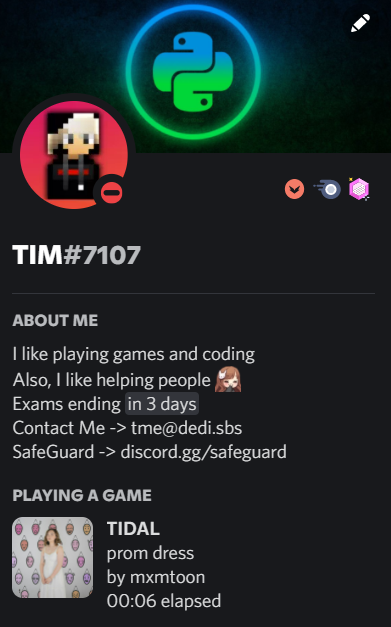

# TIDAL-RPC
<a href="https://tidal.com">Tidal</a> RPC for Discord (Third Party) like spotify integration with discord!

<strong>Important Note:</strong> 
Works only on <strong>windows</strong> as of now.

<strong>Preview:</strong>  

<strong>How it works:</strong>
1. Fetches the process ids of programs run by the user (not services) using <a href="https://pypi.org/project/pywinauto/">pywinauto</a> 
2. <a href="https://pypi.org/project/psutil/">Psutil</a> parses the process id into the real name of program. 
3. We then check if the name of the program is Tidal and get the song name using <a href="https://pypi.org/project/pywinauto/">pywinauto</a>. 
4. We use the <a href="https://spotify.com">spotify</a> api to fetch the album art of the song (Ironic, I know lol). The <a href="https://pypi.org/project/spotipy/">spotipy</a> library helps us to do this. 
5. Finally we use the <a href="https://pypi.org/project/pypresence/">pypresence</a> library to connect to discord RPC :). 

<strong>Upcoming:</strong>  
Currently working on bringing buttons that allow anyone to directly click the button to listen to the song on any music streaming platform of their choice!
